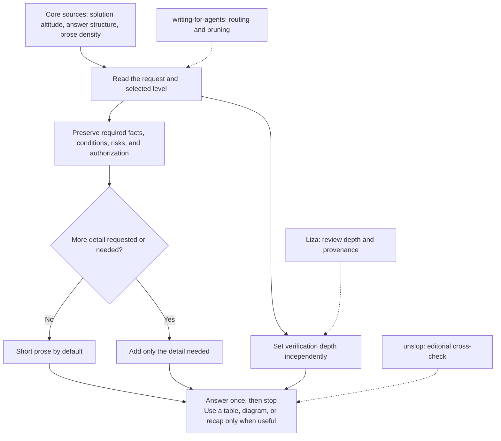

<div align="center">

# flow-lean

<table>
  <tr>
    <td width="64">
      <a href="https://www.florian.bruniaux.com/about/?utm_source=github&amp;utm_medium=readme&amp;utm_campaign=flow-lean"></a>
    </td>
    <td>
      <strong><a href="https://www.florian.bruniaux.com/about/?utm_source=github&amp;utm_medium=readme&amp;utm_campaign=flow-lean">Florian BRUNIAUX</a></strong> &middot; AI Founding Engineer @ <a href="https://methode-aristote.fr/">Méthode Aristote</a><br />
      13 years from developer to CTO / VP Eng &middot; <a href="https://www.florian.bruniaux.com/blog/?utm_source=github&amp;utm_medium=readme&amp;utm_campaign=flow-lean">Blog &#8599;</a> &middot; <a href="https://www.florian.bruniaux.com/projects/?utm_source=github&amp;utm_medium=readme&amp;utm_campaign=flow-lean">Projects &#8599;</a>
    </td>
  </tr>
</table>

Adaptive output control for LLM agents: minimal solution, action-first
structure, proof-preserving density. Native installation is documented for
Claude Code and Codex; other hosts can load the same plain-Markdown skill.

[](LICENSE)

<a href="#examples">Examples</a> ·
<a href="#install">Install</a> ·
<a href="#verify">Verify</a> ·
<a href="#what-it-does">What it does</a> ·
<a href="#why">Why</a> ·
<a href="#eval">Eval</a> ·
<a href="CHANGELOG.md">Changelog</a>

</div>

## Examples

**By task type.** Compression scales with what's being asked, not blindly with
the level:

<table>
<tr>
<th>Situation</th>
<th>Without flow-lean</th>
<th>With flow-lean</th>
</tr>
<tr>
<td valign="top">Implement a feature</td>
<td valign="top">

Great question! There are a few different ways
you could approach this. Let me walk you through
the options before we decide together.

</td>
<td valign="top">

Run `pnpm add zod`, then wrap the input at
`src/schema.ts:12`. Proof: `pnpm test schema`.
One risk: the existing `parse()` throws on null,
handle it or the API 500s. Rest is mechanical.

</td>
</tr>
<tr>
<td valign="top">Tradeoff: SSR or SSG for a high-traffic blog</td>
<td valign="top">

Both have tradeoffs worth considering. SSR gives
fresher content on every request but costs more
server load. SSG is faster and cheaper to host but
content can go stale between builds. It depends on
your specific needs and traffic patterns.

</td>
<td valign="top">

Use SSG, not SSR. Blog pages are usually shared and
change when an article is published, so pre-rendering
removes per-request rendering cost. Rebuild or use
incremental regeneration after publication. Use SSR
only when the page must vary per request.

</td>
</tr>
<tr>
<td valign="top">Factual lookup, <code>/flow-lean ultra</code></td>
<td valign="top">

To find the last commit that changed a file, you
can use the git log command with a path filter,
which will show you the commit history for that
specific file.

</td>
<td valign="top">

`git log -1 --format=%H -- src/auth.ts`

</td>
</tr>
</table>

**By level.** Required information and explicit detail requests always win;
the selected level sets the default density. Same prompt ("what's the difference
between debounce and throttle") at each level:

| Level | Response |
|-------|----------|
| `detailed` (`lite`) | Debounce waits until input stops for a set delay, then fires once, useful for a search box you don't want to query on every keystroke. Throttle fires at a fixed interval no matter how often the event repeats, useful for a scroll handler you want running steadily. |
| `concise` (`full`, default) | Debounce delays until input stops for N ms, then fires once. Throttle fires at a fixed interval regardless of event frequency. Debounce for a search box, wait for typing to stop. Throttle for a scroll handler, run steadily. |
| `ultra` | Not shown here. Explanations keep the detail needed to understand them. `ultra` is reserved for factual and debug lookups, see the git example above. |

## Install

### Claude Code

```bash
claude plugin marketplace add FlorianBruniaux/flow-lean
claude plugin install flow-lean@flow-lean
```

### Codex

```bash
codex plugin marketplace add FlorianBruniaux/flow-lean
codex plugin add flow-lean@flow-lean
```

Codex versions without the `plugin` subcommand can use the legacy skill
projection instead:

```bash
git clone https://github.com/FlorianBruniaux/flow-lean.git ~/.local/share/flow-lean
mkdir -p ~/.codex/skills
ln -s ~/.local/share/flow-lean/skills/flow-lean ~/.codex/skills/flow-lean
```

### Other LLM agents

Use the canonical [`skills/flow-lean/SKILL.md`](skills/flow-lean/SKILL.md)
through the host's native skill mechanism or load it as persistent system,
developer, or project instructions. The rules are model-agnostic Markdown;
discovery, persistence, commands, and automatic routing remain host-specific
and must be verified in that environment.

Restart the host session after installation. Claude Code and current Codex
versions load the same plugin; the legacy Codex projection resolves the same
canonical [`SKILL.md`](skills/flow-lean/SKILL.md), not a host-specific rewrite.

## Verify

First verify installation, not behavior:

```bash
# Claude Code: the entry must contain flow-lean@flow-lean and enabled
claude plugin list

# Codex: the JSON entry must contain installed=true and enabled=true
codex plugin list --json
```

For the legacy Codex projection, verify that the canonical file resolves:

```bash
test -f ~/.codex/skills/flow-lean/SKILL.md
```

Then open a fresh session and use this behavioral canary:

```text
Use flow-lean ultra. Give only the Git command that prints the last commit
which changed src/auth.ts.
```

The answer should start with
`git log -1 --format=%H -- src/auth.ts` and end with a `Skills used:` footer
containing `flow-lean`. A listed plugin checks installation; this canary
checks the visible response. A footer is a model declaration, not proof of
native skill loading. Inspect the host's skill-loading events separately.

To verify automatic routing, repeat the test in another fresh session without
naming the skill: `Be concise. Give only the Git command that prints the last
commit which changed src/auth.ts.` The footer should still contain `flow-lean`.
Confirm automatic selection through the host's loading events; a missing
footer alone cannot distinguish a routing failure from a response failure.

Installation makes flow-lean available, not automatically active for every
request. For always-on concise mode, add this instruction to the host's global
instruction file (`~/.claude/CLAUDE.md` or `~/.codex/AGENTS.md`):

```text
Load and apply the installed flow-lean skill in concise mode by default.
```

## What it does

Three fused disciplines, one rule underneath: every token earns its place.

- **ponytail**: minimal solution, ladder from "skip it" down to "the minimum code that works"
- **i-have-adhd**: action-first, command or verdict in line one, numbered steps
- **caveman**: zero-fat density, cut sentences that carry no action, evidence,
  required context, or decision

Ordinary replies aim for about 80 words, with the result first and at most
three short bullets or a short paragraph. This is a target, not a quota:
stop once the request is satisfied. Requested detail, executable steps,
required evidence, and material limits take priority.

Status reports keep completion facts once and ask a question only when a
necessary user decision is missing. Unknown production performance must not
be expanded into unverified functionality. Rollback plans preserve concurrent
edits and restore the original state, including the absence of new files.

Use short prose by default. Tables help compare repeated fields; diagrams
help explain a flow. Neither is mandatory just because there are several
items. Use a sequence diagram for runtime exchanges when their order helps,
and mark proposed or unknown behavior explicitly.

Switch density with `/flow-lean detailed|concise|ultra`; `lite` and `full`
remain aliases. Sensitive topics retain the relevant risks, conditions, and
authorization boundaries without automatically expanding into long prose.

It also adds:

- `recap=auto`: no extra recap by default; summarize when requested or when
  a handoff needs state that has not already been stated together;
- stable handles such as `D1` and `R1` when later replies need to target one
  decision or risk;
- an optional `Skills used: ...` footer, enabled by default and disabled with
  `skills footer off`;
- review-depth separation: short output never means shallow verification, and
  independent review is recommended only when it could change the decision;
- voice separation: the assistant speaks for itself; a message drafted for
  the user preserves that user's facts, voice, and commitments.

Full mechanics: [`skills/flow-lean/SKILL.md`](skills/flow-lean/SKILL.md).

## Why

### Core fusion

Three existing skills already push toward less verbose output, each covering a
different part of the problem. Caveman compresses
prose (zero preamble, symbols over words, code and commands kept byte-exact)
but does not touch what gets built or how it is structured. Ponytail decides
what to code (YAGNI, stdlib before a library, one line before ten) but not the
form. i-have-adhd decides the form (action-first, numbered steps, proof by
command) but not the density. Stacked together they step on each other, and two
of adhd's own rules are actively harmful: estimating in minutes, and stripping
tangents in a way that can hide a real risk.

flow-lean fuses the three under one rule, then applies that rule through a
response process:



<details>
<summary>ASCII fallback</summary>

```text
request + selected level
          |
          v
preserve facts, conditions, risks, authorization
          |
          v
more detail requested or needed?
       /              \
     no               yes
     |                 |
short prose       necessary detail
       \              /
        answer once, then stop

Verification depth is independent of response length.
Use tables, diagrams, and recaps only when they help.
```

</details>

Where it goes further than any of the source skills:

- A recommendation gives the verdict, decisive reason, and the tradeoff that
  could change the choice. It can be short if those facts remain clear.
- Destructive actions, security, and material cost keep the necessary
  conditions, consequences, and authorization boundaries. Their presence
  alone does not require a long answer.
- It sizes work in effort or steps, never in minutes, a confident "15 min" from
  a model is a guess dressed up as a fact.
- It separates response length from review depth. Consequential or uncertain
  work keeps its checks; a same-agent self-check is never presented as an
  independent review.

Historical v0.2.0 runs measured mixed-work net compression around 20-30%, not
the 50-75% Caveman's README cites for narrower tasks. The current public skill
and 25-case suite have no new paired comparison result. Earlier scores remain
historical evidence, not a current compression or performance claim.

## Eval

[`EVAL.md`](EVAL.md) is a 25-case regression battery, form (brevity, useful
formatting, requested detail, and preserved risk) and fact (no invented
specifics) graded apart. Run it in a fresh
session after any change to `SKILL.md` to catch regressions before they ship.

The [0.3.3 source-update checks](evals/results/concision-2026-09-27.md)
record the focused Claude/Codex checks, isolated Claude installation,
and local BM25 routing. They also retain known factual limitations,
routing misses, and two Codex batch timeouts; this is not a full benchmark pass.

[`evals/`](evals/) is a separate, real API-backed harness (forked from
[i-have-adhd](https://github.com/ayghri/i-have-adhd)'s own eval script) that
blind-judges flow-lean against a plain baseline and against each of the three
source skills, using the current case set and the weighted rubric in
[`evals/rubric.md`](evals/rubric.md):

The scores below are the historical v0.2.0 snapshot on its 13-case suite. They
remain reproducible in `evals/results/`, but must not be compared with a future
25-case run as if the suites were identical.

| vs | baseline | flow-lean | comparator |
|---|---:|---:|---:|
| plain baseline | 4.32 | **4.52** | n/a |
| caveman | 4.24 | **4.62** | 3.98 |
| ponytail | 4.28 | **4.80** | 4.57 |
| i-have-adhd | 4.12 | **4.85** | 4.21 |

In that v0.2.0 snapshot, flow-lean won the weighted score in every run, driven mostly by
decision-fidelity and concision, the two dimensions none of the three source
skills individually target. This is a single trial per case (n=1, Claude
Sonnet 5), not a proof: re-running the same comparison during development
moved the weighted score by 0.2-0.3 points on an unchanged skill, and one run
surfaced a real regression (compression dropping a safety detail) that got
fixed and re-verified, see commit history in `evals/results/` for the full,
uncherry-picked trail including the runs that failed. Raw responses and judged
scores: [`evals/results/`](evals/results/).

## Sources and design references

### Core sources

flow-lean fuses three disciplines from three existing Claude Code skills:

- [caveman](https://github.com/JuliusBrussee/caveman): zero-fat density
- [ponytail](https://github.com/DietrichGebert/ponytail): minimal solution ladder
- [i-have-adhd](https://github.com/ayghri/i-have-adhd): action-first structure

### Later design references

- [writing-for-agents](https://github.com/mattpocock/skills/blob/main/skills/productivity/writing-for-agents/SKILL.md):
  context pointers, progressive disclosure, pruning, and one source of truth.
- [unslop](https://github.com/cursor/plugins/blob/main/pstack/skills/unslop/SKILL.md):
  a cross-check for generic phrasing, formatting habits, filler, and editorial
  warning signs. It is not presented as the source of flow-lean's earlier
  anti-AI rules.
- [Liza's adversarial pairing](https://github.com/liza-mas/liza/tree/main/skills/adversarial-pairing):
  the review-depth boundary and honest reviewer provenance.

These are scoped references, not a claim that flow-lean copied their full
workflows. In particular, it does not copy Liza's blackboard, polling, worktree,
or multi-agent lifecycle.

<!-- BEGIN GENERATED RELATED PROJECTS -->
<!-- Source: https://github.com/FlorianBruniaux/FlorianBruniaux/blob/main/ecosystem/projects.json; project: flow-lean -->
## Explore the ecosystem

These projects extend the workflow without duplicating this tool:

- **Measure with [cc-skill-usage](https://github.com/FlorianBruniaux/cc-skill-usage)**: verify that the skill is invoked in real transcripts rather than only mentioned.
- **Optimize with [RTK](https://github.com/rtk-ai/rtk)**: flow-lean reduces model prose while RTK reduces command output.
- **Learn with [Claude Code Ultimate Guide](https://github.com/FlorianBruniaux/claude-code-ultimate-guide)**: place response density inside the broader context-engineering model.

[Browse the complete open-source galaxy](https://github.com/FlorianBruniaux#open-source-galaxy)
<!-- END GENERATED RELATED PROJECTS -->

## License

MIT, see [LICENSE](LICENSE).
